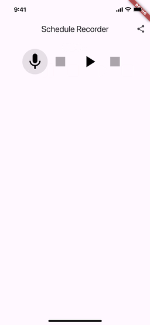
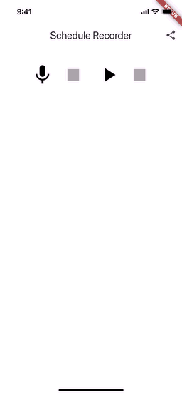

# Schedule Recorder

- Schedule Recorderは、Flutterをベースにした音声を録音し、予定管理に活用できるアプリケーションです。
    - 予定管理といいつつ、現状は音声録音と再生のみです。
- **iOSだけに**最適化された設計と機能を備えています。Androidでは正しく動作しません。

## デモ動画

- 音声録音時のデモ動画



- 通話中に録音を一時停止と自動再開したデモ動画



## 特徴

### iOS向けの機能と設計

- iOSのAVFoundationによる高度な音声処理
    - スピーカー出力とBluetooth機器のサポート
    - カスタマイズされた音声セッション管理
- iOSのCallKitとの完全な統合
    - iOSのシステムイベント（着信）にも対応し、録音を中断・再開する機能を提供
    - 着信・発信時の自動録音制御
    - 通話状態のリアルタイム監視
    - 通話終了後の録音自動再開
    - VoIP/SIP通話アプリとの連携
        - ST500などのVoIPアプリ使用時の録音中断・再開にも対応
        - オーディオルート変更の検出による通話状態の把握
        - Bluetooth通話デバイスのサポート
- FlutterとNative（Swift）間の最適化された通信
    - 双方向のMethodChannel実装
    - 詳細なデバッグログシステム
    - 状態管理の完全な同期
- iOSのバックグラウンドタスク対応
    - 録音中でもバックグラウンドで動作可能な設計を採用
- ファイル共有機能
    - ファイル共有に対応
    - 他のアプリへの音声ファイルの共有が可能
    - **他のアプリからの共有ファイル受信には現状未対応**

### 全般的な機能

- 音声録音
    - ボタン一つで録音を開始・停止可能。
- 音声再生
    - 録音した音声データを再生。
- エラーハンドリング
    - 不明な操作やエラーを適切に通知。
- ログ機能
    - アプリケーションの動作状況を詳細に記録。
    - デバッグやトラブルシューティングに活用可能。
- 状態管理
    - Riverpodを使用した効率的な状態管理。
    - 予測可能で安全な状態の更新。

## iOS固有の設定

### Info.plist の設定

1. マイク使用権限
   - アプリがマイクを使用する際のユーザー許可を取得可能にする

    ```xml
    <key>NSMicrophoneUsageDescription</key>
    <string>Microphone access is required to record audio.</string>
    ```

2. バックグラウンド実行の設定
   - アプリがバックグラウンドでも録音を継続可能にする
   - オーディオ処理をバックグラウンドで実行可能にする

    ```xml
    <key>UIBackgroundModes</key>
    <array>
        <string>audio</string>
        <string>processing</string>
    </array>
    ```

3. ファイル共有の設定
   - ファイル共有が可能な他のアプリに対して音声ファイルを共有可能にする

    ```xml
    <key>LSSupportsOpeningDocumentsInPlace</key>
    <true/>
    <key>UIFileSharingEnabled</key>
    <true/>
    ```

4. ファイルタイプの設定
   - このアプリの共有メニューから音声ファイル（.m4a, .mp3）を共有可能にする

    ```xml
    <key>CFBundleDocumentTypes</key>
    <array>
        <dict>
            <key>CFBundleTypeName</key>
            <string>Audio</string>
            <key>LSHandlerRank</key>
            <string>Alternate</string>
            <key>LSItemContentTypes</key>
            <array>
                <string>public.audio</string>
                <string>public.mp3</string>
                <string>public.mpeg-4-audio</string>
                <string>com.apple.m4a-audio</string>
            </array>
        </dict>
    </array>
    ```

## 機能概要

1. 録音機能
   - マイクアイコンのタップで録音を開始。
   - 録音中に一時停止アイコンを表示。
   - 録音一時停止後は、再び録音を開始可能。

2. 再生機能
   - 再生アイコンのタップで録音データを再生。
   - 再生中に停止アイコンを表示。

3. システムイベントの処理
   - 録音中に着電があり、応答した場合のみ、自動的に停止。
   - 応答後に電話を切ると、自動的に録音を再開し、前回の録音の継続を行う。

4. 録音中に電話が鳴った場合
    - 録音は継続される（状態は変化しない）
    - 「録音中...」のテキストが表示されたまま

5. 録音中に電話に出た場合
    - 自動的に一時停止する（pauseメソッドが呼ばれる）
    - 「録音一時停止中...」のテキストが表示される
    - 再開アイコンが表示される

6. 電話を自分から切った場合
    - 自動的に録音を再開する（resumeメソッドが呼ばれる）
    - 「録音中...」のテキストが表示される
    - 一時停止アイコンが表示される

7. 電話を相手が切った場合
    - 自動的に録音を再開する（resumeメソッドが呼ばれる）
    - 「録音中...」のテキストが表示される
    - 一時停止アイコンが表示される

8. 音声ファイルの統一性
    - 一時停止と再開で同じファイルを使用する（stopメソッドは一度だけ呼ばれる）

## 通話中の録音動作仕様

以下のデシジョンテーブルは、通話時の録音動作の仕様を示しています。キャリア回線による通話とVoIP/SIP通話の両方に適用されます。

| **条件**                                | 1 | 2 | 3 | 4 | 5 | 6 | 7 |
|-----------------------------------|---|---|---|---|---|---|---|
| 録音中である                          | Y | Y | Y | Y | Y | Y | N |
| 通話が開始される                           | Y | Y | Y | Y | Y | Y | - |
| 通話に応答する                           | N | N | Y | Y | Y | Y | - |
| 自分から通話を終了                      | Y | N | Y | N | Y | N | - |
| 相手が通話を終了                       | N | Y | N | Y | N | Y | - |
| VoIP/SIP通話である                     | N | N | N | N | Y | Y | - |
| **アクション**                           |   |   |   |   |   |   |   |
| 録音を継続する                        | Y | Y | N | N | N | N | - |
| 録音を一時停止する                     | N | N | Y | Y | Y | Y | - |
| 録音を再開する                        | N | N | Y | Y | Y | Y | - |
| 一時停止前のデータと再開後のデータを1ファイルにする | Y | Y | Y | Y | Y | Y | - |

### シナリオ説明

1. 録音中に電話が鳴って、電話に出ずに自分で切る
   - 録音は継続される
   - 状態は変化しない

2. 録音中に電話が鳴って、電話に出ずに相手が切る
   - 録音は継続される
   - 状態は変化しない

3. 録音中に電話が鳴って、電話に出て、自分が切る
   - 録音は自動的に一時停止する
   - 通話終了後、自動的に録音を再開する
   - 一時停止前のデータと再開後のデータは1つのファイルに保存される

4. 録音中に電話が鳴って、電話に出て、相手が切る
   - 録音は自動的に一時停止する
   - 通話終了後、自動的に録音を再開する
   - 一時停止前のデータと再開後のデータは1つのファイルに保存される

5. 録音中にVoIP/SIPアプリで通話を開始し、自分で終了する
   - 録音は自動的に一時停止する
   - 通話終了後、自動的に録音を再開する
   - 一時停止前のデータと再開後のデータは1つのファイルに保存される

6. 録音中にVoIP/SIPアプリで通話を開始し、相手が終了する
   - 録音は自動的に一時停止する
   - 通話終了後、自動的に録音を再開する
   - 一時停止前のデータと再開後のデータは1つのファイルに保存される

7. 録音中でない場合
   - 通話による影響を受けない

### 注意点

- 録音の一時停止と再開は、通話に応答した場合のみ発生します
- 通話に応答しなかった場合は、録音は継続されます
- 録音再開時は、一時停止前のデータと再開後のデータが1つのファイルに保存されます
- 録音中でない場合は、通話による影響を受けません
- VoIP/SIP通話も通常の電話と同様に処理されます
- ST500などのVoIPアプリ使用時も、オーディオルート変更を検出して適切に処理します

## 設計詳細

### アーキテクチャ

- MVCパターン
    - UIとロジックを分離して、テスト可能性と保守性を向上。
- サービスレイヤー
    - AudioServiceを用いて、音声録音・再生機能を統一的に管理。
    - FileSharingServiceを用いて、ファイル共有機能を管理。
- 状態管理
    - Riverpodを採用し、アプリケーション全体の状態を効率的に管理。
    - Provider、StateNotifier、StateProviderを使用した適切な状態管理の実装。
- NativeとFlutterの連携
    - MethodChannelを活用して、FlutterとiOSのネイティブコードを効率的に接続。
    - swiftのコードは`ios/Runner/AppDelegate.swift`を参照してください。

### 主なクラスと役割

- `SchedulePage`: ユーザーインターフェースを管理。
- `AudioService`: 録音・再生のロジックを提供。
- `FileSharingService`: ファイル共有機能を管理。
- `RecordingButtons`: 録音関連のUIコンポーネントを提供。
- `AudioFileList`: 録音ファイルの一覧表示を管理。

### 依存パッケージ

主要な依存パッケージとその用途：

- MethodChannelによるNative APIの呼び出し
    - 録音イベント（中断・再開）をハンドリング。
- バックグラウンドオーディオセッション
    - iOS特有のバックグラウンド処理を適用。

## テスト

### テストの種類

1. ウィジェットテスト
   - `RecordingButtons`のUI操作テスト
   - `AudioFileList`の表示テスト
   - 状態変更時のUI更新テスト

2. ユニットテスト
   - `AudioService`のメソッドテスト
   - `FileSharingService`の機能テスト
   - Riverpodプロバイダーのテスト

- 録音と再生のボタン操作
    - UI操作をモックして、各状態が正しく遷移するかを確認。
- AudioServiceのメソッドテスト
    - iOSのネイティブイベント（例: `RecordingInterrupted`）が正しくハンドリングされることを確認。

### テスト実行方法

```bash
# ユニットテストに必要なMockを作成する。なお、riverpod_annotationのためのg.dartファイルもこのコマンドで生成する。
dart run build_runner build --delete-conflicting-outputs

# ユニットテストを実行する
flutter test

# 特定のテストファイルを実行
flutter test test/widgets/schedule_page/recording_buttons_test.dart
flutter test test/widgets/schedule_page/audio_file_list_test.dart
```

## インストールとセットアップ

### 開発環境のセットアップ

1. Flutterのインストール
    - Flutterがインストールされていない場合は、公式サイトを参照してセットアップしてください。
    - Flutter自体のバージョン管理には`fvm`を使用しています。

2. lefthookのセットアップ
    - コード品質を維持するため、git commit時に自動的にコードの整形とチェックを行います

    ```bash
    # lefthookのインストール
    brew install lefthook

    # プロジェクトへのlefthookの設定
    lefthook install
    ```

3. プロジェクトのセットアップ

    ```bash
    # 依存パッケージのインストール
    flutter pub get

    # アプリの実行
    flutter run
    ```

### lefthookの機能

以下の処理がgit commit時に自動的に実行されます

1. コードの自動修正
    - `dart fix --apply lib`による自動修正の適用
2. インポート文の整理
    - `import_sorter`によるインポート文の整理
3. コードフォーマット
    - `dart format`によるコードスタイルの統一

- 注意事項
    - git commitに`--no-verify`オプションを使用すると、これらのチェックがスキップされます
    - チェックをスキップすると、CIでエラーとなる可能性があります
    - 問題が発生した場合は`lefthook run pre-commit -d`でデバッグモードで実行できます

### iOSのビルド

- Xcodeを用いてiOS向けにビルドする場合:

    ```bash
    open ios/Runner.xcworkspace
    Xcodeでターゲットを選択し、ビルドを実行。
    ```

- iOSデバイスでの信頼設定
    1. `flutter install`でアプリをインストールした後、アプリを起動する前に以下の設定が必要です
    2. iOSデバイスの「設定」アプリを開く
    3. 「一般」>「VPNとデバイス管理」を選択
    4. 開発者のメールアドレスを選択
    5. 「このデベロッパを信頼」を選択
    6. この設定後、アプリが正常に起動できるようになります

## トラブルシューティング

### 一般的な問題

1. マイク権限の問題
    - 症状: 録音が開始されない
    - 解決: iOSの設定でマイク権限がこのアプリに許可されているかを確認
    - 解決: ios/Runner/Info.plistのマイク権限を確認

    ```xml
    <key>NSMicrophoneUsageDescription</key>
    <string>Microphone access is required to record audio.</string>
    ```

    - 解決: ios/Podfileのマイク権限を確認

    ```ruby
    post_install do |installer|
    installer.pods_project.targets.each do |target|
        flutter_additional_ios_build_settings(target)

        target.build_configurations.each do |config|
        config.build_settings['GCC_PREPROCESSOR_DEFINITIONS'] ||= [
            '$(inherited)',
            ## dart: PermissionGroup.microphone
            'PERMISSION_MICROPHONE=1',
        ]
        end
    end
    end
    ```

2. バックグラウンド録音
    - 症状: バックグラウンドで録音が停止
    - 解決: ios/Runner/Info.plistのバックグラウンド設定を確認

    ```xml
    <key>UIBackgroundModes</key>
    <array>
        <string>audio</string>
        <string>processing</string>
    </array>
    ```

3. 署名とプロビジョニングの問題
    - 症状: ビルド時に`No profiles for 'com.example.scheduleRecorder' were found` というエラーが発生
    - 解決手順:
        1. Xcodeで`ios/Runner.xcworkspace`を開く
        2. RunnerプロジェクトのSigningセクションで以下を確認
            - Teamが選択されているか
                - Personal Teamでもビルド/ビルド後のインストールはできます
            - Bundle Identifierが正しく設定されているか
            - Automatically manage signingが有効になっているか
        3. Product > Clean Build Folderを実行
        4. Product > Buildを実行
    - 代替解決策:
        - コマンドラインでビルドする場合は `-allowProvisioningUpdates` オプションを追加:

        ```bash
        flutter build ios --allow-provisioning-updates
        ```

## 開発者向け実装詳細

### iOS側の実装詳細

1. **AVAudioSessionの管理**
   - `setupAudioSession()`メソッドで初期設定
   - カテゴリ: `.playAndRecord`
   - モード: `.voiceChat`（VoIP通話に最適化）
   - オプション: `.defaultToSpeaker`, `.allowBluetooth`, `.allowAirPlay`
   - 録音中断時の自動ハンドリング
   - `configureAudioSessionForRecording()`による録音最適化

2. **通話イベントの処理**
   - `CXCallObserverDelegate`による通常電話の通話状態監視
   - `AVAudioSession.routeChangeNotification`によるVoIP/SIP通話の検出
   - `AVAudioSession.isOtherAudioPlaying`による音声通話の監視
   - 通話開始時の録音一時停止と終了時の再開
   - VoIPデバイス接続/切断の検出と処理

3. **CallKit統合**
   - `CXProvider`と`CXCallController`による通話管理
   - VoIP/SIP通話のCallKitへの通知
   - `CXProviderDelegate`による通話状態変更の処理
   - 通話終了時の安全な録音再開

4. **録音状態の同期**
   - `GetRecordState`イベント: 録音状態の取得
   - `RecordingInterrupted`イベント: 録音の一時停止
   - `RecordingResumed`イベント: 録音の再開
   - `ConfigureAudioSessionForRecording`イベント: オーディオセッションの設定
   - 状態変更時のMethodChannelを通じたFlutter側への通知

5. **VoIP/SIPデバイス検出**
   - `isSIPDevice()`によるVoIPデバイスの判別
   - デバイス接続時の通話状態チェック
   - 複数種類のオーディオ機器の対応（Bluetooth、USB、有線など）

### Flutter側の実装詳細

1. **状態管理**
   - `RecordingStateNotifier`による録音状態の管理
   - 状態遷移: 停止 → 録音中 → 一時停止
   - 各状態でのUI更新とユーザー操作の制御
   - `AudioServiceNotifier`による詳細な録音状態管理

2. **録音処理**
   - `record`パッケージによる録音機能の実装
   - 録音設定:
     - エンコーダー: `AudioEncoder.aacLc`
     - ビットレート: 128000
     - サンプルレート: 44100
   - 録音再開時の複数回試行メカニズム

3. **イベントハンドリング**
   - iOS側からのイベントをMethodChannelで受信
   - 録音状態の自動更新
   - 通話（キャリア回線・VoIP/SIP）検出時の録音一時停止
   - 通話終了後の録音再開処理
   - エラー発生時のログ出力と状態リセット

4. **オーディオセッション管理**
   - iOS側のオーディオセッション設定を要求
   - 録音再開前のオーディオセッション最適化
   - 通話モードと録音モードの適切な切り替え

### 実装上の注意点

1. **録音の一時停止と再開**
   - 同一ファイルでの録音継続
   - 状態遷移の正確な管理
   - UIの適切な更新

2. **エラーハンドリング**
   - 録音失敗時の適切な状態リセット
   - ユーザーへのエラー通知
   - ログ出力による問題追跡

3. **リソース管理**
   - 録音セッションの適切な開放
   - メモリリークの防止
   - バックグラウンド処理の最適化

### デバッグとトラブルシューティング

1. **ログ出力**
   - 状態変更時のログ
   - エラー発生時の詳細情報
   - 録音操作の実行順序

2. **一般的な問題と解決策**
   - 録音が再開されない: AVAudioSessionの状態を確認
   - 音量が低い: オーディオセッションの設定を確認
   - 状態が不整合: ログを確認し状態遷移を追跡
   - VoIP通話検出されない: オーディオルート変更通知を確認
   - 通話後のファイルが空: 録音の再開プロセスとファイル操作を確認

3. **テスト項目**
   - 手動での一時停止/再開
   - キャリア回線通話による中断/再開
   - VoIP/SIPアプリでの通話による中断/再開
   - Bluetoothデバイスを使用した通話テスト
   - バックグラウンド録音
   - エラー発生時の動作

## 今後の改善点

- 文字列定数の管理
    - 文字列はすべて`lib/constants/strings.dart`で管理する。
    - ログ文字列は現状ではこのファイルで管理していません。
- クラウド連携
    - 録音データをクラウドストレージに保存する機能。
- 音声認識
    - 音声データを文字起こしするAPIとの統合。
